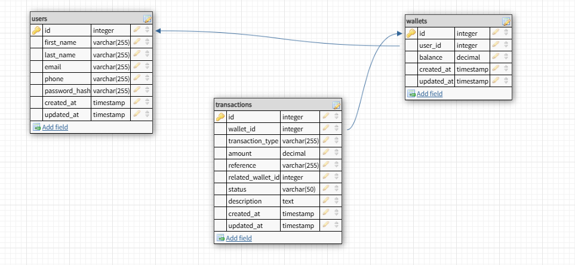

# Lendsqr Backend Assessment
Backend Wallet Service built with Node.js, TypeScript, KnexJS, and MySQL for the Lendsqr Backend Engineering Assessment.

## Overview
This project implements a wallet service that allows users to:

- Create an account
- Fund their wallet
- Transfer funds to other users
- Withdraw funds
- Prevent onboarding of users found in the Lendsqr Adjutor Karma blacklist

## Features

- User onboarding
- Wallet creation
- Wallet funding
- Wallet transfers
- Wallet withdrawals
- Karma blacklist verification
- Faux token authentication
- Transaction management
- Unit testing

## Architecture
*To be completed*

## Database Design
The application uses a relational database design with three core entities: Users, Wallets, and Transactions.

### Users
The users table stores account information for registered users.

| Column | Type | Description |
|--------|------|-------------|
| id | BIGINT | Primary key |
| first_name | VARCHAR | User's first name |
| last_name | VARCHAR | User's last name |
| email | VARCHAR | Unique email address |
| phone | VARCHAR | Unique phone number |
| password_hash | VARCHAR | Hashed password |
| created_at | TIMESTAMP | Record creation timestamp |
| updated_at | TIMESTAMP | Record update timestamp |
### Wallets
Each user is assigned a single wallet upon successful onboarding.

| Column | Type | Description |
|--------|------|-------------|
| id | BIGINT | Primary key |
| user_id | BIGINT | Foreign key to users table |
| balance | DECIMAL(15,2) | Current wallet balance |
| created_at | TIMESTAMP | Record creation timestamp |
| updated_at | TIMESTAMP | Record update timestamp |
### Transactions
The transactions table serves as the wallet ledger and stores all wallet activities.

| Column | Type | Description |
|--------|------|-------------|
| id | BIGINT | Primary key |
| wallet_id | BIGINT | Foreign key to wallets table |
| transaction_type | VARCHAR | Transaction category |
| amount | DECIMAL(15,2) | Transaction amount |
| reference | VARCHAR | Unique transaction reference |
| related_wallet_id | BIGINT | Related wallet for transfer operations |
| status | VARCHAR | Transaction status |
| description | TEXT | Transaction description |
| created_at | TIMESTAMP | Record creation timestamp |
| updated_at | TIMESTAMP | Record update timestamp |
### Transaction Types
The following transaction types are supported:

- FUND
- WITHDRAWAL
- TRANSFER_SENT
- TRANSFER_RECEIVED

### Relationships

- A User has one Wallet (1:1)
- A Wallet belongs to one User
- A Wallet can have many Transactions (1:M)
- A Transaction belongs to one Wallet

This design provides a clear audit trail for all wallet activities and supports transactional consistency during money movement operations.

## ER Diagram

The wallet service is built around three core entities:

- Users
- Wallets
- Transactions

Relationships:

- A User has one Wallet (1:1)
- A Wallet belongs to one User
- A Wallet can have many Transactions (1:M)
- A Transaction belongs to one Wallet

The ER Diagram for the application is shown below:



## API Documentation

### Authentication

#### Login

```
POST /api/auth/login
```
Authenticates a user and returns a token used for subsequent requests.

### Users

#### Create User

```
POST /api/users
```
Creates a new user account after validating that the user is not present on the Lendsqr Adjutor Karma blacklist. A wallet is automatically created for successful registrations.

### Wallet

#### Fund Wallet

```
POST /api/wallets/fund
```
Adds funds to the authenticated user's wallet.

#### Transfer Funds

```
POST /api/wallets/transfer
```
Transfers funds from the authenticated user's wallet to another user's wallet.

#### Withdraw Funds

```
POST /api/wallets/withdraw
```
Withdraws funds from the authenticated user's wallet.

#### Get Wallet Balance

```
GET /api/wallets/balance
```
Returns the current balance of the authenticated user's wallet.

#### Get Transaction History

```
GET /api/wallets/transactions
```
Returns all transactions associated with the authenticated user's wallet.

Detailed request and response examples will be added as implementation progresses.

## Authentication Strategy
The assessment requirements specify that a full authentication system is not required. Therefore, the application uses a simplified faux authentication approach to protect wallet operations without introducing the complexity of JWTs, sessions, or OAuth.

### Registration
Users register with:

- First name
- Last name
- Email address
- Phone number
- Password

During registration:

1. User input is validated.
2. The user's email is checked against the Lendsqr Adjutor Karma blacklist.
3. The password is hashed using bcrypt before storage.
4. A user record is created.
5. A wallet is automatically created with an initial balance of `0.00`.

User creation and wallet creation are executed within a single database transaction to ensure consistency.

### Authentication
For the purpose of this assessment, authenticated requests use the following format:

```
Authorization: Bearer <user_id>
```

Example:

```
Authorization: Bearer 1
```

The authentication middleware extracts the user ID from the authorization header, validates that the user exists, and attaches the authenticated user to the request object.

### Protected Routes
The following endpoints require authentication:

- Fund Wallet
- Transfer Funds
- Withdraw Funds
- Get Wallet Balance
- Get Transaction History

### Authentication Flow

1. Client sends the user ID in the Authorization header.
2. Authentication middleware validates the format.
3. The middleware retrieves the user from the database.
4. The authenticated user is attached to the request object.
5. The request proceeds to the protected route handler.

### Why This Approach?
The assessment explicitly states that a full authentication system is not required and that a faux token-based authentication approach is acceptable.

This implementation keeps the solution lightweight while still demonstrating:

- Route protection
- Authentication middleware
- User identification
- Authorization of wallet operations
- Separation of concerns

In a production environment, this approach would be replaced with a secure authentication mechanism such as JWT access tokens, refresh tokens, session management, and role-based access control.

## Transaction Strategy

Since the application manages financial transactions, maintaining data consistency is critical. Database transactions are used to ensure that wallet balances and transaction records remain synchronized.

### Funding a Wallet

When a wallet is funded:

1. The wallet balance is increased.
2. A transaction record is created.
3. Both operations are executed within a database transaction.

If any operation fails, all changes are rolled back.

### Withdrawing Funds

When a user withdraws funds:

1. The wallet balance is validated to ensure sufficient funds are available.
2. The wallet balance is decreased.
3. A withdrawal transaction record is created.
4. Both operations are executed within a database transaction.

If any operation fails, all changes are rolled back.

### Transferring Funds

Transfers involve two wallets and therefore require stronger consistency guarantees.

When a transfer is initiated:

1. The sender's wallet balance is validated.
2. The sender's wallet is debited.
3. The recipient's wallet is credited.
4. A `TRANSFER_SENT` transaction record is created for the sender.
5. A `TRANSFER_RECEIVED` transaction record is created for the recipient.
6. Both transaction records share the same transaction reference.
7. All operations are executed within a single database transaction.

If any step fails, the entire transaction is rolled back to prevent partial updates and maintain data integrity.

### Transaction References

Each financial operation is assigned a unique transaction reference.

For transfers, both the sender and recipient transaction records share the same reference, allowing both sides of the transaction to be traced and audited easily.

### Transaction Status

Transactions may have one of the following statuses:

- PENDING
- SUCCESS
- FAILED

## Security Considerations
*To be completed*

## Testing
*To be completed*

## Setup Instructions
*To be completed*

## Deployment
*To be completed*